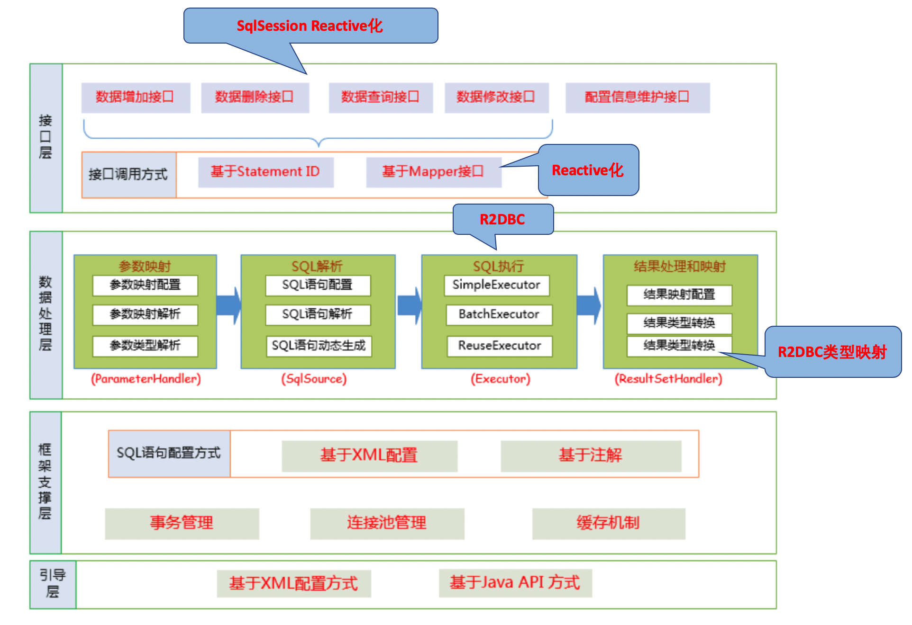

MyBatis R2DBC Adapter
=====================

将MyBatis Reactive化，将底层的JDBC替换为R2DBC，从而实现全面异步化，提升数据库访问性能。

# MyBatis R2DBC工作原理



* 对数据CRUD操作SqlSession接口进行Reactive化，对于R2DBC适配来说为ReactiveSqlSession
* Mapper接口Reactive化，将函数的类型从对象和List调整为Mono和Flux
* SQL的执行器调整为R2DBC的接口，这里我们不需要类似MyBatis的Executor机制，Reactive框架为R2DBC提供了执行调度功能
* 结果处理和映射：[R2DBC Data Types](https://r2dbc.io/spec/0.8.2.RELEASE/spec/html/#datatypes) 支持，你也可以扩展R2DBCTypeHandler添加自定义类型。MyBatis R2DBC增加了JDBC Types的支持，主要是考虑兼容性。

# 如何使用?

和MyBatis的使用流程一样，如下：

```
// construct MyBatis Configuration
XMLConfigBuilder xmlConfigBuilder = new XMLConfigBuilder(this.getClass().getResourceAsStream("/mybatis-config.xml"));
Configuration configuration = xmlConfigBuilder.parse();

// construct Reactive SQL Session Factory
ReactiveSqlSessionFactory reactiveSqlSessionFactory = new DefaultReactiveSqlSessionFactory(configuration);
ReactiveSqlSession reactiveSqlSession = reactiveSqlSessionFactory.openSession();

// construct Reactive Mapper interface
UserReactiveMapper userMapper = reactiveSqlSession.getMapper(UserReactiveMapper.class);
```

# 特性

* 兼容MyBatis 3的配置和编程接口，主要是Mapper接口和SQL的XML配置方式
* XxxMapper 调整为 Reactive 接口
* Metrics support: 每一个statement的metrics都可以被记录
* R2DBC Pool支持
* Dynamic SQL支持

# 核心工作

* 将底层的JDBC调整为R2DBC
* 兼容 Spring Data R2DBC
* r2dbc-mysql的兼容性测试
* TypeHandler支持

# 主要调整点

* Reactive SqlSessionFactory
* Reactive SqlSession
* Reactive Mapper interface

### R2DBC-MyBatis支持的数据类型

R2DBC有标准的Data Types支持，可以在 https://r2dbc.io/spec/0.8.1.RELEASE/spec/html/#datatypes 进行查阅

考虑到MyBatis JDBC支持的类型，以下的类型也是被支持的：

* Java Date: java.util.Date, java.sql.Date, java.sql.Time, java.sql.Timestamp

# R2DBC Transaction

Please use R2dbcTransactionManager from Spring Data R2DBC

# MySQL的R2DBC Driver

* MariaDB R2DBC connector: 由MariaDB官方开发，作者有20年以上的Java开发经验 https://github.com/mariadb-corporation/mariadb-connector-r2dbc
* R2DBC MySQL: Mirro Mutth，居住在深圳的中国工程师  https://github.com/mirromutth/r2dbc-mysql

从目前开发的情况来看，可能MariaDB R2DBC更具有前景一些。

# TypeHandler支持

MyBatis针对resultMap的result有一个typeHandler的设置，可以进行Java对象字段和数据库表的column直接进行值转换。 在MyBatis R2DBC中我们保留这一特性。
由于R2DBC和JDBC的API完全不同，所以新增了一个R2DBCTypeHandler接口，代码如下：

```java
public interface R2DBCTypeHandler<T> {

    void setParameter(Statement statement, int i, T parameter, JdbcType jdbcType) throws R2dbcException;

    T getResult(Row row, String columnName, RowMetadata rowMetadata) throws R2dbcException;

    T getResult(Row row, int columnIndex, RowMetadata rowMetadata) throws R2dbcException;

    Class<?> getType();
}
```

但是考虑到实际的MyBatis的配置验证，新建的TypeHandler实现需要同时继承TypeHandler和R2DBCTypeHandler接口，同时也保证在JDBC和R2DBC同时生效。

你可以参考 org.apache.ibatis.r2dbc.type 开发包下的type handler进行编写，同时JDBC的时间类型的兼容，也是通过type handler完成的。

Java Enum type handler和MyBatis处理机制类似，只是类名调整到R2DBC下的EnumOrdinalTypeHandler，代码如下：

```xml
 <typeHandlers>
        <!-- Enum ordinal type handler-->
        <typeHandler handler="org.apache.ibatis.r2dbc.type.EnumOrdinalTypeHandler"
                     javaType="java.math.RoundingMode"/>
 </typeHandlers>
```

*注意：* @MappedJdbcTypes类型的TypeHandler不支持

# Transaction支持

Reactive Transaction 支持  https://spring.io/blog/2019/05/16/reactive-transactions-with-spring

Spring的R2dbcTransactionManager是基于R2DBC的ConnectionFactory，所以我们不需要进行什么配置，基本代码如下：

```java
public class R2dbcTransactionManagerAutoConfiguration {

	@Bean
	@ConditionalOnMissingBean(ReactiveTransactionManager.class)
	public R2dbcTransactionManager connectionFactoryTransactionManager(ConnectionFactory connectionFactory) {
		return new R2dbcTransactionManager(connectionFactory);
	}

}
```

如果是基于R2DBC Pool，R2dbcTransactionManager就是基于ConnectionPool的，当然ConnectionPool就是继承自ConnectionFactory的。

# 配置参数

和R2DBC相关的配置参数，主要是通过MyBatis的mybatis-config.xml文件中的properties配置完成的，如下：

```xml
<configuration>
    <properties>
        <property name="metrics.enabled" value="true"/>
        <property name="r2dbc.pool.initial-size" value="1"/>
        <property name="r2dbc.pool.max-size" value="10"/>
        <!-- max idle time, the unit is Minute-->
        <property name="r2dbc.pool.max-idle-time" value="5"/>
    </properties>
</configuration>
```

# R2DBC MyBatis的不同点

背后的原因其实主要是JDBC和R2DBC的区别，我们都知道JDBC同步Block的，所以我们需要有连接池DataSource，防止应为JDBC的等待造成Thread的堵塞。

## SqlSession ReactiveSqlSession
MyBatis的一个核心是SqlSession，但是两者的设计还有很大的区别的：

* MyBatis的原生SqlSession是基于JDBC，是Block的，所以存在SessionHolder的感念，如commit，rollback, close等API
* ReactiveSqlSession则是 异步 + 单例(Singleton)的，和Spring的WebClient，Spring Data R2DBC的DatabaseClient一样的，只是名字还是叫做Session，和MyBatis一致而已。

###  DataSource和R2DBC Pool
JDBC使用连接池这个大家都明白， 通过增加连接数减少因为JDBC Connection等待的结果造成的block，不然应用整体的性能下降的非常快。
在R2DBC中也有Connection Pool的概念，其主要是兼容传统数据库同步协议，如MySQL，解释如下：

>> Traditionally, many MySQL drivers used a synchronous approach when executing SQL statements. This meant that operations such as opening connections and executing queries were blocked until completion, which could take a long time. To allow for parallel execution, a developer had to write a multithreaded application.
>> Any MySQL client that supports the X Protocol can provide asynchronous execution, either using callbacks, Promises, or by explicitly waiting on a specific result at the moment in time when it is actually needed.

如果数据库通讯协议是全部异步的，那么是没有必要介入Connection Pool的。 如mariadb-connector-r2dbc的实现中就有： 

```
allowPipelining: Permit to send queries to server without waiting for previous query to finish
```

如果allowPipelining为false，这个时候，出于性能的考虑，你还是需要介入R2DBC Pool来提升应用性能。

Pipelining versus Parallel Query Execution请参考: https://www.percona.com/blog/2016/07/06/pipelining-versus-parallel-query-execution-with-mysql-5-7-x-plugin/

# Cache特性

对于Reactive来说，默认就包含了cache特性，也就是你可以调用 Mono.cache() 或 Flux.cache 就可以缓存响应的结果集，然后提供给后续的订阅者消费。

对应MyBatis来说，cache也并复杂，Cache也是基于Mapper的，我们只需要基于paramObject缓存对应的Mono或者Flux对象就可以。

```java
 Mono<String> user = Mono.defer(() -> {
            // r2dbc operation
            return r2dbcResult;
        }).cache(Duration.ofSeconds(2));
```

但是，这个只是基于内存的对象缓存，如果是分布式的，上述机制不能工作，这涉及到对象序列化和反序列化机制的机制。

至于选择哪一种，这个可能要根据实际的缓存类型进行决定。

# spring-boot-starter-data-r2dbc整合

如果你项目中已经包含spring-boot-starter-data-r2dbc，那么你可以完全使用Spring Boot提供的R2DBC的ConnectionFactory bean完成数据库连接相关的任务。

```java
@Bean
public ReactiveSqlSessionFactory reactiveSqlSessionFactory(ConnectionFactory r2dbcConnectionFactory)  {
  XMLConfigBuilder xmlConfigBuilder = new XMLConfigBuilder(this.getClass().getResourceAsStream("/mybatis-config.xml"));
  Configuration configuration = xmlConfigBuilder.parse();
  return new DefaultReactiveSqlSessionFactory(configuration, r2dbcConnectionFactory);
}
```

# 不支持的特性

* MyBatis Plugin机制: org.apache.ibatis.plugin.Interceptor
* 不支持配置文件中声明Reactive Mapper接口，R2DBC需要额外的API支持

```xml
<mappers>
  <mapper class="org.mybatis.builder.AuthorReactiveMapper"/>
</mappers>

```

# 参考

* MyBatis3中文文档： http://www.mybatis.org/mybatis-3/zh/index.html
* R2DBC: https://r2dbc.io/
* R2DBC 规范: https://r2dbc.io/spec/0.8.2.RELEASE/spec/html/
* R2DBC Pool: https://github.com/r2dbc/r2dbc-pool
* Spring Data R2DBC: https://github.com/spring-projects/spring-data-r2dbc  https://docs.spring.io/spring-data/r2dbc/docs/1.0.0.M2/reference/html/
